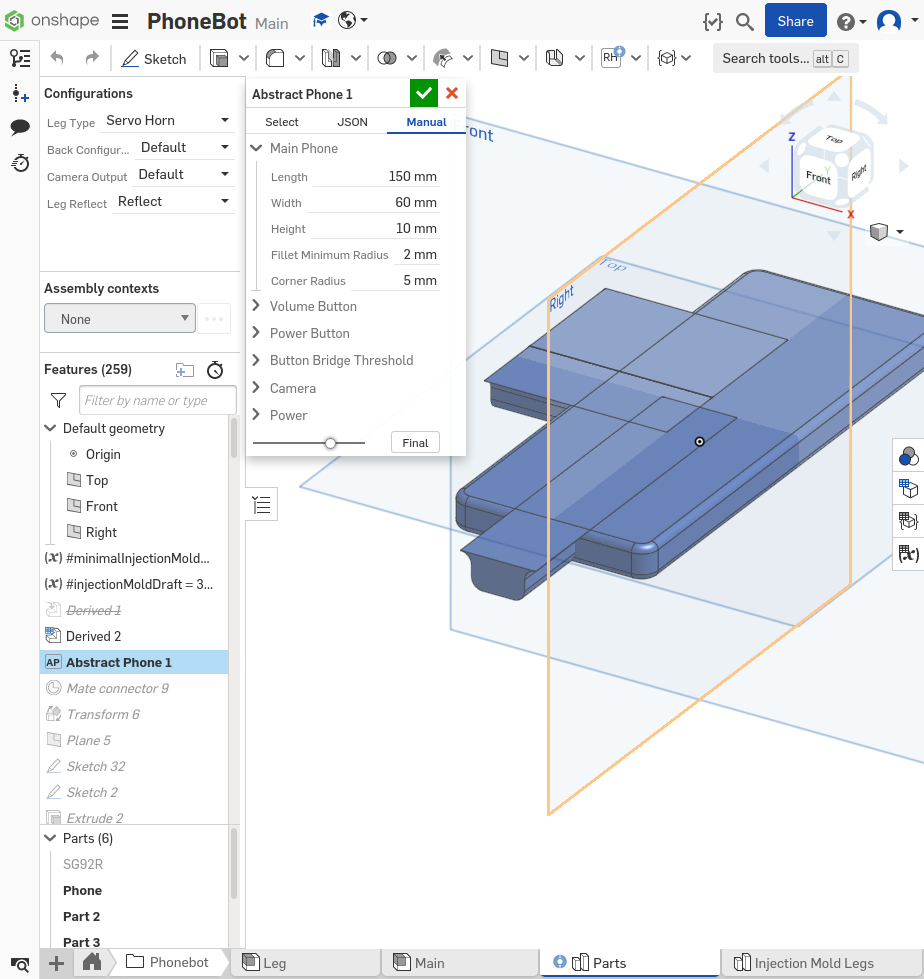

# phonebot_docs

Welcome to the PhoneBot docs! PhoneBot is a phone-case based robot that gives your phone legs! It can (theoretically) work with any phone (Android and IOS).
Modern smart phones are extremely powerful devices, and it'd be a shame to let all of that computation only power flappy bird.

We've designed PhoneBot to be completely configurable for a vast array of phones. Since the design is primarially 3D printed, only a few measurements of your phone are required to print a PhoneBot which will fit perfectly on your phone. We use OnShape to make configuring PhoneBot extremely simple, and all of the parameters are simply inserted into a single feature to configure the robot.

PhoneBot is also extremely simple to assemble, with only 18 printed parts (for an 8 DOF robot)!

Since PhoneBot is designed to utilize the power of modern smart phones, that means that we're optimizing to let you use AI as well. We have a fully built out Reinforcement Learning simulator to develop gait policies.

It is an open-sourced design meant for research, experimentation and fun. There are currently two ways to aquire a PhoneBot:

- Build one yourself
- Buy one from us
- Buy a kit from us

If you'd like to buy one, you can skip most of this documentation. If you'd like to build one, we have all the instructions on how to make and program your PhoneBot here. This documentation is divided into three main sections:

- [Electrical](electrical/getting_started.md)
- [Mechanical](mechanical/getting_started.md)
- [Software](software/getting_started.md)

These should be completed in the above order. First the PCB should be built and flashed. Next the mechanical system should be built, using the PCB. Finally the App should be built and installed to your phone.
