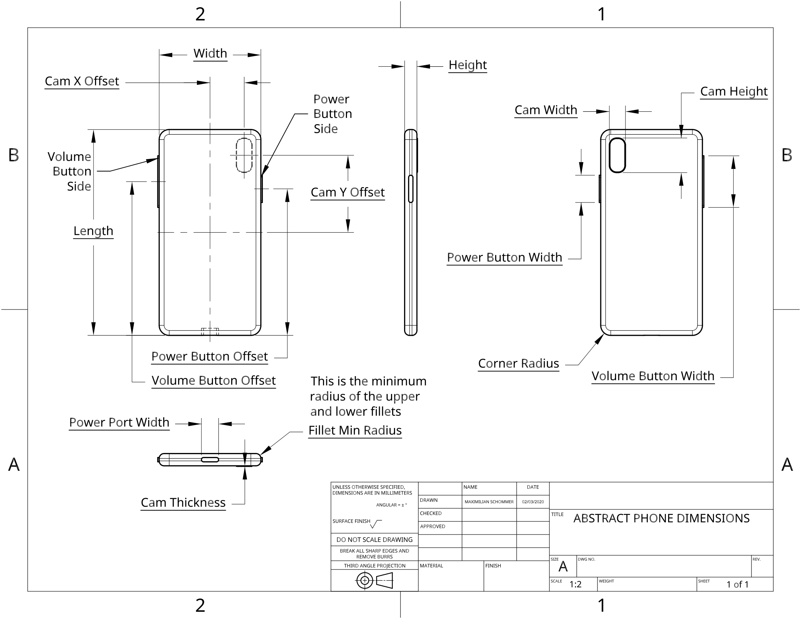
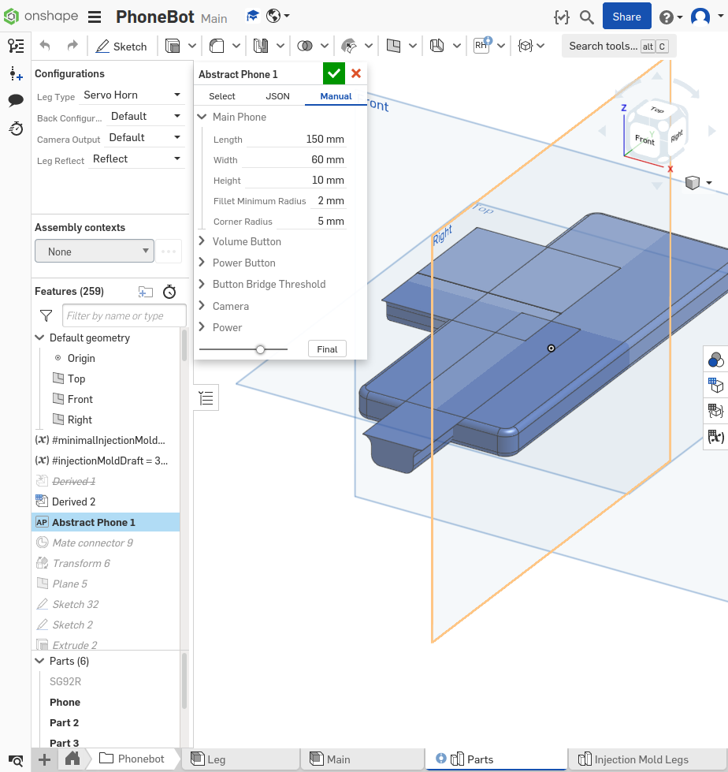
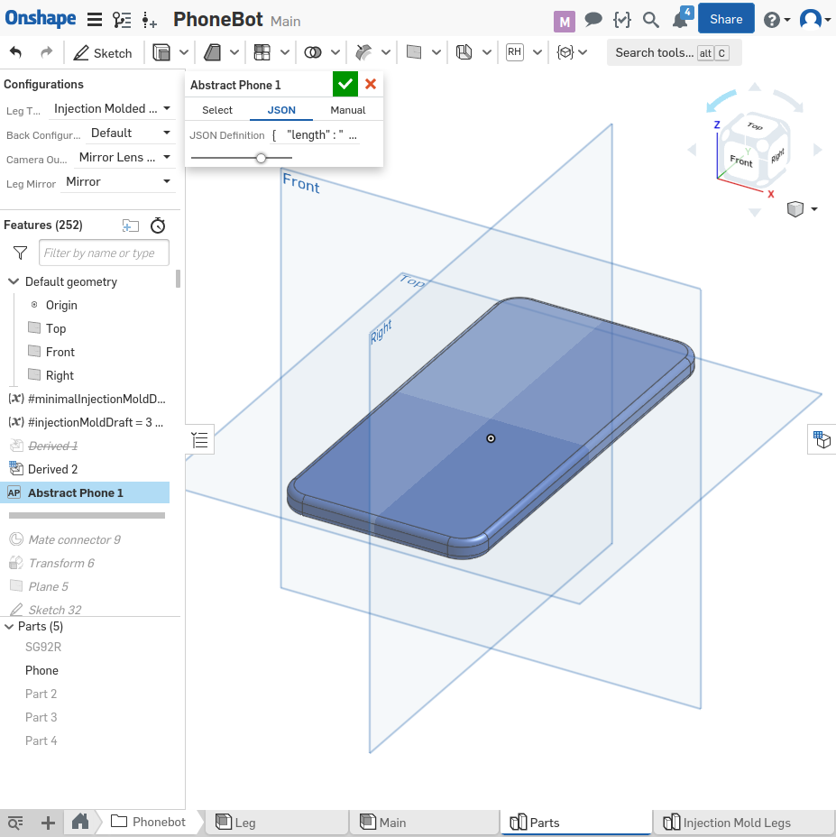

# Configure CAD

PhoneBot is designed to be completely parametric, and work for any modern smart phone above the minimum dimensions. If your phone model is not already supported, PhoneBot can be adapted to your phone if certain dimensions are known. The description of each of the dimensions required is shown below in the drawing.



Once the required dimensions are measured, there are a few parameters which should be chosen.

- `bridgeThresh` : The minimum thickness of the gap between the volume and power button if they are on the same side.
- `volumeBtnWidthOffset` : The amount of additional offset to make from the volume button for the case cutaway.
- `powerBtnWidthOffset` : The amount of additional offset to make from the power button for the case cutaway.
- `powerPortWidthOffset` : The amount of additional offset to make from the power port for the case cutaway.

There are then three ways to make a custom PhoneBot.

### Manual Configuration

Populating the feature using the `Manual` tab with the measured values.



### JSON Configuration

Populating a JSON string which can be pasted into the `Abstract Phone` custom feature in the beginning of the Onshape part studio `Phonebot/Parts` (see [the getting started](getting_started.md) for mored details). Here's an example of a JSON string to paste describing a phone.

```json
{
  "length": "143.45 mm",
  "width": "70.35 mm",
  "height": "7.18 mm",
  "filletMinRadius": "2 mm",
  "cornerRadius": "9.25 mm",
  "volumeBtnWidth": "26 mm",
  "volumeBtnWidthOffset": "2 mm",
  "volumeBtnOffset": "111.95 mm",
  "volumeBtnSide": "Left",
  "powerBtnWidth": "16 mm",
  "powerBtnWidthOffset": "2 mm",
  "powerBtnOffset": "89.45000 mm",
  "powerBtnSide": "Right",
  "bridgeThresh": "10 mm",
  "camXOffset": "0 mm",
  "camYOffset": "48.87500 mm",
  "camWidth": "15.5 mm",
  "camHeight": "15.5 mm",
  "camThickness": "1.475 mm",
  "powerPortWidth": "12 mm",
  "powerPortWidthOffset": "2 mm"
}
```

Now that your JSON has been assembled, paste the string into the text box with JSON tab selected in the `Abstract Phone` feature as shown below. Once the JSON is pasted, click outside of the box for it to load. Note the double quotes in the example above (single quotes will error).



### PhoneTable Configuration

Another way to define a phone is to insert it into the table of phones in the `Configurable Phone/Phone Models` FeatureScript file. All phone models are defined in the variable `phoneTable`. If your manufacturer is not in the table, add an entry under `entries` in the top level selection `manufacturers`, following the pattern of manufacturers currently listed. If your phone model is not in the table, then add an entry in the `model` list for your manufacturer. The entry will look similar to the JSON, as shown below.

```javascript
"Galaxy S6" : {
        'length' : 143.45 * millimeter,
        'width' : 70.35 * millimeter,
        'height' : 7.18 * millimeter,
        'filletMinRadius' : 2 * millimeter,
        'cornerRadius' : 9.25 * millimeter,
        'volumeBtnWidth' : 26 * millimeter,
        'volumeBtnWidthOffset': 0 * millimeter,
        'volumeBtnOffset' : 111.95 * millimeter,
        'volumeBtnSide' : LeftRight.LEFT,
        'powerBtnWidth' : 16 * millimeter,
        'powerBtnWidthOffset' : 0 * millimeter,
        'powerBtnOffset' : 89.45000 * millimeter,
        'powerBtnSide' : LeftRight.RIGHT,
        'bridgeThresh' : 10 * millimeter,
        'camXOffset' : 0 * millimeter,
        'camYOffset' : 48.87500 * millimeter,
        'camWidth' : 15.5 * millimeter,
        'camHeight' : 15.5 * millimeter,
        'camThickness' : 1.475 * millimeter,
        'powerPortWidth' : 12 * millimeter,
        'powerPortWidthOffset' : 0 * millimeter
}
```

If you do not have access to the Phonebot Onshape account and do not want to make a copy, you should make a pull request modifying `OnshapeData/phone_models.txt` to contain your new models. This table will be copied to the Onshape document by the maintainers of this repository regularly.
