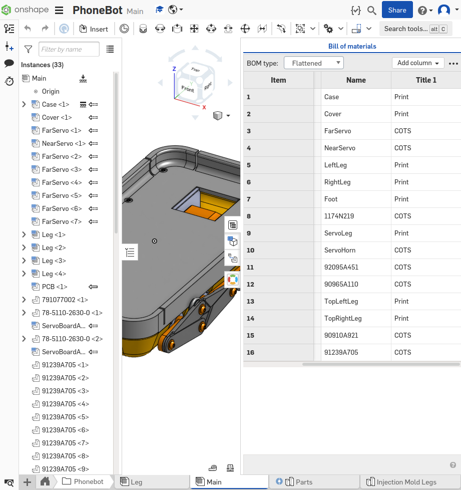

# Mechanical Getting Started

This guide assumes you have a completed PhoneBot electrical board as well as made modified servos and soldered them to their servo boards. If you haven't completed this step, go to the guide [here](../electrical/getting_started.md).

PhoneBot requires some tools and hardware in order to build.

## Tools

| Description        | Example Item         | Example Link                          |
| ------------------ | -------------------- | ------------------------------------- |
| FDM 3D Printer     | Creality Ender 3 Pro | https://www.amazon.com/dp/B07GYRQVYV  |
| M1.27 Allen Wrench | -                    | https://www.amazon.com/dp/B07CV3KYPN/ |
| Super Glue/Epoxy   | Gorilla 7700104      | https://www.amazon.com/dp/B00OAAUAX8  |

You don't need to get the specific example item for the above tool, but should make sure that you have an equivalent or better tool. The 3D printer listed above has been tested, and it's fairly low-end so most printers should work if tuned properly.

## Bill of Materials

| Description                    | Quantity | Link                                       |
| ------------------------------ | -------- | ------------------------------------------ |
| M2 x 0.40 mm Thread, 8 mm Long | 10       | https://www.mcmaster.com/91239A705/        |
| M2 x 0.40 mm Thread, 4mm Long  | 16       | https://www.mcmaster.com/92095A451/        |
| M2 Washer, 2.2 mm ID, 5 mm OD  | 16       | https://www.mcmaster.com/90965A110/        |
| M2 x 0.4mm Thread, 5mm Long    | 8        | https://www.mcmaster.com/90910A921/        |
| O-Ring 1.5 mm Wide, 6.5 mm ID  | 8        | https://www.mcmaster.com/1174N219/         |
| SG-90 Servo + horn             | 8        | http://www.towerpro.com.tw/product/sg90-7/ |

Again, the exact parts aren't needed here, but if you do substitute make sure you look at the CAD and know what you're doing.

## CAD Configuration

Now that you have all of the materials, the next step is to configure the CAD to fit your phone. PhoneBot uses [Onshape](https://www.onshape.com/en/) as it's main CAD platform. Onshape is cloud based, and the PhoneBot design is public so you can easily make a copy and modify it to fit your phone.

The PhoneBot CAD is located here:

[https://cad.onshape.com/documents/80da1f5f7946f7d9cd14baed/w/22816f3d3644e4261b6d1b92/e/1845c4ed5ccb63d25b8aa8f6](https://cad.onshape.com/documents/80da1f5f7946f7d9cd14baed/w/22816f3d3644e4261b6d1b92/e/1845c4ed5ccb63d25b8aa8f6)

Let's go through the Onshape PhoneBot directory structure. Each folder/element is listed below, with descriptions in parentheses.

- PhoneBot
  - Leg (Main Leg assembly)
  - Main (Main PhoneBot assembly)
  - Parts (Contains most non-COTS parts)
  - Injection Mold Legs (Contains leg design for injection molding)
- Configurable Phone (Contains the Abstract Phone feature for generating phone case configurations)
  - Abstract Phone Template (Template part studio for the configurable phone case feature)
  - Abstract Phone Configure (Feature to generate Abstract Phones from the template part studio)
  - Phone Models (Contains dictionaries describing known phone parameters for case)
  - Example (Example usage of the Abstract Phone feature)
  - Abstract Phone Dimensions (Drawing demonstrating what each dimension referenced in a phone config JSON refers to)
- Layouts (Contains various layouts of parts)
- Reference (Contains reference images and diagrams)
- COTS (Contains common-off-the-shelf components imported from outside world.)
- CAD Imports (Contains imported files in original format.)

In order to make your own PhoneBot, first make a copy of the CAD. It would be appreciated if you name it something like `PhoneBot - Copy` or the like so it's not confused with the official version when people search for it. Open the copy you made and open `PhoneBot/Parts` (the main part studio). The only adjustment you need to make to build PhoneBot for your phone is to edit the feature `Abstract Phone 1`.

Right click on the feature and select `Edit`. If we've already characterized your phone, you can simply select it from the list. If it is not there then you can easily configure it yourself using the `Manual` tab. For a detailed tutorial on how to configure the `Abstract Phone`, see [this guide](configure_cad.md)

## Manufacturing

Hopefully all that went well. If any errors occured in the feature tree, submit an issue here and we'll look into it.

Now that you have the PhoneBot CAD configured for your phone, it's time to manufacture the components.

Navigate to `PhoneBot/Main` in the Onshape document. Then open up the BOM table.

For every part that has `Title 1` set as `Print`, you'll need to 3d print the given quantity of that part. The easiest way to do this is to open the `PhoneBot/Parts` document at the same time in another tab, and export all of the labeled parts as STLs and then 3D print them.

## Assembly

Assembly should be fairly straight forward, since the CAD shows how everything should go togeather. The only tool needed for assembly should be a 1.27mm Allen key.
